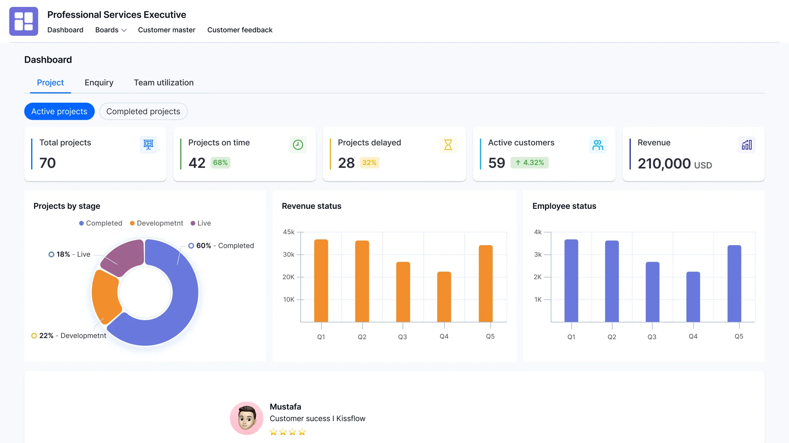

# Project name
My project focus on HTML
### Setup / installation
`npm install`

`pip install`

`composoer install`

### Todo list
- [ ] Home page
- [ ] About page
- [x] serveice page

### Screenshort



### Link
CSS Framework [Tailwindcss](https://tailwindcss.com/)
### List
Unnorder List
- one
- two
- three
    - other sub list
    - MMO
---
order list
1. one
2. two
3. three

### Text style
**Bbold text**

*Hello word*

~~Delete text~~

### Block quote
> Hello world

### Table
|id  | name | Age |
|----|------|-----|
|01  | Rady | 100 |

### Code
``` python
for i in range(10):
    print(i)
```
```html
<h1> heading </h1>